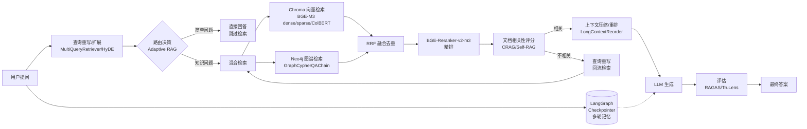

下面这些方向大致覆盖代码技术栈（LangChain + Chroma + bge-small-zh-v1.5 + RAG Chain/Agent）能继续演进的主流路线，但是**真正决定 RAG能力 80% 是数据预处理、分块策略与知识库质量，剩下的 20% 才是下面这些技术升级，建议按业务瓶颈倒序选型，而不是把所有模块都堆上去**。
先给你一张全局架构图，把所有升级点串到一条 RAG 链路里，方便判断每个模块加在哪个位置：

## 1. 混合检索（知识图谱 + 向量双路召回）

**目的：** 弥补向量检索"只见语义、不见关联"的短板，把实体关系、多跳推理这类结构化知识问题答得更准，同时保留语义模糊检索的能力。
**技术栈：** Chroma + Neo4j + LangChain 的 `GraphCypherQAChain` / `LLMGraphTransformer`（或微软 GraphRAG / LightRAG 作为抽取端）。
**做法：**

- 入库阶段：文档切分后，用 `LLMGraphTransformer` 让 LLM 抽取实体和关系三元组写入 Neo4j，同时原文 chunk 仍走 bge-small-zh 向量存 Chroma；如果要做高质量图谱，可用微软 GraphRAG 离线跑实体抽取 + 社区检测摘要，再把 parquet 结果导入 Neo4j。
- 检索阶段：用户问题先经 LLM 抽取实体锚点 + 查询改写，两路并发——Neo4j 做 2 跳子图查询（带关系类型过滤）返回结构化三元组，Chroma 走 HNSW 相似检索返回文本 chunk。
- 融合阶段：用 RRF（Reciprocal Rank Fusion）按排名加权（典型权重 图 0.6 / 向量 0.4，可按 query 类型动态调）去重合并，再进入下一阶段的重排。
- 兼容性：可以包成一个新的 `Retriever` 同时供 RAG Chain 和 RAG Agent 的工具调用，Agent 里再加一个路由判断"该走图谱还是向量还是两者兼用"。
  **优先级/难度：** 高优先级 / 中高难度（图谱本体设计是主要工作量）。

---

## 2. 检索结果重排序（Rerank 精排）

**目的：** 对于向量检索，top-10 里真正相关的可能只有 2~3 条且不在前列；用 Cross-Encoder 精排把最相关的内容顶到前面，直接降低幻觉率，是性价比最高的提升手段。
**技术栈：** `BAAI/bge-reranker-v2-m3` + LangChain 的 `ContextualCompressionRetriever` + `CrossEncoderReranker` + `HuggingFaceCrossEncoder`。
**做法：**

- 部署：本地用 FlagEmbedding 起 HTTP 服务，或直接用 `HuggingFaceCrossEncoder(model_name="BAAI/bge-reranker-v2-m3")` 内嵌进 LangChain。
- 接入链路：把 Chroma 检索器的 `search_kwargs={"k": 20}` 调大做粗召回，外层套 `ContextualCompressionRetriever`，其 `base_compressor` 用 `CrossEncoderReranker`，最终 `top_n=3~5` 送进 LLM。
- 关键点：reranker 与 embedding 是两种模型，不能互相替代——bge-small 是 Bi-Encoder（快但粗），bge-reranker-v2-m3 是 Cross-Encoder（慢但准，把 query+doc 拼起来跑注意力）。
- 兼容性：纯检索层改造，RAG Chain 和 RAG Agent 都零成本接入；生产建议加主备实例 + 故障降级（rerank 挂了走原始向量分数排序）。
  **优先级/难度：** 最高优先级 / 低难度（投入产出比最高）。

---

## 3. 查询重写与扩展（检索前预处理）

**目的：** 用户口语化查询、指代不明、短查询向量区分度低，直接检索召回率很差；用 LLM 把单条 query 扩成多条视角的变体，或生成假设性文档对齐语义空间。
**技术栈：** LangChain 的 `MultiQueryRetriever`、`rewrite_retrieve_read` 模板、HyDE（Hypothetical Document Embeddings）。
**做法：**

- **MultiQueryRetriever：** LLM 基于原始问题生成 3~5 个语义相关但表述不同的查询变体，并行检索 Chroma，结果去重合并，能显著提升召回率且不改动向量库。
- **HyDE：** 先让 LLM 生成一篇"假设性答案文档"，用这篇伪文档的 embedding 去检索真实文档，对齐 query 与 doc 的语义空间（query 短、doc 长，分布不一致是常见漏召回原因）。
- **rewrite_retrieve_read：** LangChain 官方模板，把"重写→检索→阅读"做成一个 LCEL 链，适合口语化、上下文依赖的查询。
- **Step-Back / 子问题分解：** 复杂多跳问题拆成子问题分别检索再合并，适合"比较 A 和 B"这类需求。
- 兼容性：完全可以作为 RAG Chain 入口前置节点，或作为 RAG Agent 工具调用前的一步。
  **优先级/难度：** 高优先级 / 低难度。

---

## 4. 升级 Embedding 模型（BGE-M3 多功能检索）

**目的：** `bge-small-zh-v1.5` 是 33M 参数、512 维、512 token 上下文的轻量模型，存在上下文不够用、区分度低、长文档截断三个硬伤；换成 BGE-M3 一次前向同时输出 dense / sparse / ColBERT 三种表示，单模型即覆盖语义+关键词+细粒度三种检索。
**技术栈：** `BAAI/bge-m3`（566M 参数、1024 维、8192 token、100+ 语言）+ Chroma（dense 模式）或 Milvus（dense+sparse 混合）。
**做法：**

- **方案一（保留 Chroma，只用 dense）：** 把 `HuggingFaceEmbeddings` 的 `model_name` 从 `bge-small-zh-v1.5` 换成 `bge-m3`，向量从 512 维升到 1024 维，**需要重建整个 Chroma 索引**（旧向量维度不兼容）。
- **方案二（启用完整三模态）：** Chroma 不原生支持 sparse/ColBERT，要么自建服务把 sparse 作为 metadata 存，要么换 Milvus / PGVector 等支持多向量类型的库；M3 通过 XLM-RoBERTa 主干 + 三个头一次推理产出三种表示。
- **效果：** 上下文从 512 升到 8192，chunk 不再被强行截尾；dense 抓语义、sparse 抓关键词精确匹配（"电梯井""JGJ80"这种稀有术语不再被平均稀释）、ColBERT 抓长文档 token 级对齐。
- 兼容性：RAG Chain/Agent 都无感，但**迁移成本高**（全库重新向量化），建议和"重排序"路线一起做，一次重建到位。
  **优先级/难度：** 中优先级 / 中高难度（主要是迁移重建工作）。

---

## 5. LangGraph 状态机改造

**目的：** LangChain 的 LCEL Chain 是线性 DAG，无法流畅实现"检索质量差→重写 query→重新检索"这类循环；AgentExecutor 又是黑盒，中间步骤不可干预。LangGraph 把 Chain 拆成 State + Nodes + Edges，支持循环、条件分支、断点续传，是 LangChain 官方推荐的复杂 Agent 底座。
**技术栈：** LangGraph（`StateGraph`、`create_react_agent`、`add_conditional_edges`）+ 仍复用 LangChain 组件（`ChatPromptTemplate`、`ChatOpenAI`、向量库 retriever）。
**做法：**

- **第一步：** 用 `TypedDict` 定义 State（messages、question、documents、generation 等字段），这是图的共享数据结构。
- **第二步：** 把原来 RAG Chain 的 `检索→拼 prompt→LLM` 拆成独立节点：`retrieve` / `grade_documents` / `generate` / `rewrite_query`。
- **第三步：** 用 `add_conditional_edges` 控制流转，例如 grade 节点判断"文档不相关"就走 rewrite → 回到 retrieve，形成自愈闭环。
- **RAG Chain vs RAG Agent 的迁移差异：**
  - RAG Chain → 升级成 LangGraph 图，本质还是固定流程但加了条件分支和循环能力；
  - RAG Agent → 直接用 `create_react_agent(model, tools, checkpointer=...)` 替换 AgentExecutor，改动最小但获得状态管理、HITL、持久化能力。
- 兼容性：LangGraph 不是替代 LangChain，而是给它换一个更强大的"底盘"，原来的 retriever、embedding、向量库全部复用。
  **优先级/难度：** 高优先级（是后续 CRAG/Self-RAG/多轮记忆的前置依赖） / 中等难度。

---

## 6. 多轮记忆与上下文持久化

**目的：** 当前如果用 `ConversationBufferMemory` 这套旧 API，LangChain 0.3 已经废弃，且不支持多用户隔离、断点续传、时间旅行；生产场景需要"用户多轮对话能记住""服务重启不丢上下文""跨会话的长期用户偏好"。
**技术栈：** LangGraph Checkpointer（`InMemorySaver` / `SqliteSaver` / `PostgresSaver` / `RedisSaver`）+ Store（长期记忆）。
**做法：**

- **短期记忆（会话级）：** 编译图时传入 `checkpointer=PostgresSaver(...)`，每个 super-step 自动存快照，用 `thread_id` 区分用户/会话；`InMemorySaver` 仅用于开发，重启即丢。
- **长期记忆（跨会话）：** 用 LangGraph 的 `Store`（key-value，按 namespace 组织）存用户偏好、历史任务结果，可对接向量库做语义检索。
- **记忆压缩：** 长会话用 LLM 每 N 轮做摘要压缩，避免 State 膨胀；过期清理避免记忆混淆。
- 兼容性：这一步必须先做 LangGraph 改造（路线 5），是它的直接收益。
  **优先级/难度：** 中优先级 / 中等难度（生产环境用 Postgres/Redis 后端是标配）。

---

## 7. RAG 自我反思与纠错（CRAG / Self-RAG / Adaptive RAG）

**目的：** 朴素 RAG 不管检索质量好坏都生成，导致幻觉；引入"检索评估器 + 自我反思 + 网络兜底"让系统会判断"这次检索靠不靠谱""要不要重新检索"。
**技术栈：** LangGraph 状态机 + 检索评分 LLM（Pydantic 结构化输出）+ Tavily/搜索引擎兜底 + LangGraph 官方 `langgraph_crag` 示例。
**做法：**

- **CRAG（纠正性 RAG）：** 检索后加一个 `grade_documents` 节点，LLM 对每篇文档打 yes/no 相关性分；至少一篇相关就生成（生成前还可做"知识细化"切条过滤），全不相关就触发 web search 补充。
- **Self-RAG：** 在生成后再加一层"答案是否有文档支撑"的反思评估，不通过则回流重写 query 重检索。
- **Adaptive RAG：** 入口加路由节点，LLM 判断问题是"简单事实（直接答）/ 知识检索 / 需 web"分流，避免"1+1 等于几"也去检索向量库。
- 兼容性：本质就是路线 5 的 LangGraph 图上加几个节点和条件边，RAG Chain 模式受益最大（原来死板的流程变灵活），RAG Agent 模式天然就是这种结构。
  **优先级/难度：** 中优先级 / 中高难度（评估器 prompt 调优是主要工作量）。

---

## 8. 评估体系搭建（RAGAS / TruLens）

**目的：** 没有评估的 RAG 是裸奔——你不知道 bug 出在 embedding、chunking、reranker 还是 LLM；端到端打分等于不打分，必须分层归因到"检索好不好 + 生成好不好"。
**技术栈：** RAGAS（事实标准）+ TruLens（实时追踪看板）+ LangSmith（可选）。
**做法：**

- **RAGAS 四维指标：**
  - 检索层：`context_precision`（检索到的相关比例）、`context_recall`（覆盖 ground truth 的比例）；
  - 生成层：`faithfulness`（答案是否基于上下文，无幻觉）、`answer_relevancy`（是否切题）。
- **数据准备：** 准备 `{question, ground_truth, contexts, answer}` 数据集，answer 和 contexts 由 RAG 系统跑出来填充。
- **持续集成：** 把 RAGAS 跑进 CI/CD，每次改 embedding/chunking/reranker 都跑回归测试集，设定 `Recall@5 ≥ 0.85`、`Faithfulness ≥ 0.9` 阈值阻断部署。
- **TruLens：** 用装饰器记录每次调用的输入/输出/延迟，做生产监控；RAGAS 适合离线评估，TruLens 适合在线观测。
- 兼容性：纯外围工具，对 RAG Chain/Agent 零侵入。
  **优先级/难度：** 高优先级（没评估就没迭代依据） / 低难度（但需要持续维护测试集）。

---

## 9. 上下文压缩与重排

**目的：** LLM 在长上下文里有"lost in the middle"问题——中间位置的信息容易被忽略；同时检索回来的 chunk 往往冗余，需要压缩和重排。
**技术栈：** LangChain 的 `LongContextReorder`、`ContextualCompressionRetriever`、父文档检索（Parent Document Retriever）、`LLMChainExtractor`。
**做法：**

- **LongContextReorder：** 把检索结果按"相关-最不相关-次相关"交替排列，规避中段丢失。
- **上下文压缩：** 用 `LLMChainExtractor` 或 `EmbeddingsFilter` 在 rerank 后再过滤掉与 query 无关的片段，减少 token 消耗。
- **父文档检索：** 检索时用小 chunk（精确召回），送给 LLM 时替换成其所属的大 chunk（完整上下文），兼顾召回率和上下文完整性。
- 兼容性：检索层后处理，与重排序路线（路线 2）天然搭配。
  **优先级/难度：** 中优先级 / 低难度。

---

## 10. Agentic RAG 与多 Agent 协作

**目的：** 把单一 RAG Agent 升级成多 Agent 协作，例如"规划 Agent 拆解任务 → 多个专业检索 Agent（向量 Agent / 图谱 Agent / Web Agent）并行检索 → 聚合 Agent 合并 → 审阅 Agent 校验"，处理复杂多步推理任务。
**技术栈：** LangGraph 多节点编排 + `create_react_agent` 子 Agent + Supervisor 模式。
**做法：**

- 用 LangGraph 把每个能力封装成独立子图节点（向量检索节点、图谱检索节点、web 检索节点、生成节点、审阅节点）。
- Supervisor Agent 负责任务分发和结果聚合，用条件边控制"还需补充信息就回流到检索节点"。
- 各子 Agent 共享同一个 State，通过 `thread_id` 隔离不同会话。
- 兼容性：这是路线 5 的高级形态，本质是把 RAG Agent 模式从单 Agent 扩展成 Agent 编排。
  **优先级/难度：** 低优先级（业务复杂度不够时收益不显） / 高难度。

---

## 11. Schema 中的本体对 RAG 和 Chroma 增强

### 小主题一：Schema 本体增强 Chroma（检索引擎层）

**目的：** 向量检索的致命弱点是“只见语义相似，不见概念边界”。在 AI 这种概念高度交织的领域，极易发生“跨概念语义污染”。本体在 Chroma 层的价值在于构建语义隔离区，通过元数据物理过滤，从检索源头阻断概念污染。
**技术栈：** Chroma (Metadata `where` 过滤) + 领域 Schema 字典 (充当轻量级本体)。
**做法：**

* **入库阶段（本体约束 Chroma）：** 文档切分后，定义领域本体 Schema（如 `Architecture`架构、`LLM_Model`模型）。让 LLM 根据该 Schema 为每个 chunk 打上概念标签，作为隐形 metadata 存入 Chroma，将扁平的向量库变成受控的分类语义空间。
* **检索阶段（子空间硬过滤）：** 确定目标概念后，在 Chroma 查询时施加 `where={"concept_type": <目标概念>}`，将全局模糊匹配直接降维到某个概念子空间内计算 HNSW 相似度。

### 核心示例

> **真实的文档内容（已存入 Chroma）：**
>
> 1. `Transformer 架构的核心原理是基于自注意力机制，通过并行计算权重来捕捉依赖。` (后台隐形标签: Architecture)
> 2. `GPT-4 作为强大的 Transformer 模型，其卓越表现充分证明了该架构原理的泛化价值。` (后台隐形标签: LLM_Model)
>    **用户提问**：“请解释一下 Transformer 的核心架构原理是什么？”
>    **传统 Chroma 检索（无本体）：**
>    系统直接将问题向量化全库检索。由于文本 2 中也包含了“架构原理”等字眼，其与问题的余弦相似度极高，会和文本 1 一起被错误召回，给下游生成埋下隐患。
>    **本体增强 Chroma 检索：**
>    系统识别目标意图为架构后，查询附加 `where={"concept_type": "Architecture"}`。Chroma 在底层直接物理拦截了文本 2（GPT-4 模型应用），仅在架构子空间内返回文本 1，从源头保证了检索结果的纯净度。

---

### 小主题二：Schema 本体增强 RAG（应用生成层）

**目的：** 传统 RAG 将检索到的混合文本无脑拼接喂给 LLM，大模型缺乏认知框架，容易产生跨概念幻觉。本体在 RAG 层的价值在于作为“认知框架”注入大模型，让生成具备概念边界，并提供概念级溯源能力。
**技术栈：** LangChain (Pydantic 结构化输出意图解析) + 结构化 Prompt 模板。
**做法：**

* **意图锚定：** 用户提问后，先让 LLM 将问题解析并映射到本体的特定概念标签上。
* **生成阶段（结构化上下文）：** 把带标签的 chunk 以结构化格式组装（如 `[参考资料 1 - 概念: Architecture] xxx`）注入 Prompt，让大模型带着结构化认知阅读，并在回答中要求指明依据的概念来源。

### 核心示例

> **检索召回的上下文（假设已召回混合文本）：**
>
> 1. `[概念: Architecture] Transformer 架构的核心原理是自注意力机制...`
> 2. `[概念: Framework] 在 LangChain 中，开发者需要理解 Transformer 架构原理，以便设计 Prompt 调用接口...`
>    **用户提问**：“请解释一下 Transformer 的核心架构原理是什么？”
>    **传统 RAG 生成（无本体约束）：**
>    LLM 拿到拼接的长文本，产生认知混淆，会将理论定义与工程应用混为一谈，生成诸如：“Transformer 的核心架构原理是自注意力机制，您可以通过 LangChain 深入理解它并设计 Prompt 来调用...”的**答非所问/幻觉回答**。
>    **本体增强 RAG 生成：**
>    LLM 在 Prompt 中明确看到了文本的 `[概念: Framework]` 标签，理解当前用户询问的是 `[Architecture]`。大模型在生成时自动剥离 Framework 文本的干扰，仅基于架构文本精准作答，并在末尾输出溯源：“*本回答主要依据【Architecture】概念下的参考资料生成。*”
>    **优先级/难度：** 高优先级（防概念混淆的最轻量方案） / 中等难度（本体 Schema 设计和意图解析调优是主要工作量）。

**优先级/难度：** 高优先级（防概念混淆的最轻量方案） / 中等难度（本体 Schema 设计和意图解析调优是主要工作量）。

---

## 升级路线优先级与落地顺序总览

| 路线             | 目的           | 技术栈                   | 优先级 | 难度 | 依赖前置       |
| ---------------- | -------------- | ------------------------ | ------ | ---- | -------------- |
| 2 重排序         | 精排降幻觉     | bge-reranker-v2-m3       | ⭐⭐⭐ | 低   | 无             |
| 3 查询重写       | 提召回         | MultiQueryRetriever/HyDE | ⭐⭐⭐ | 低   | 无             |
| 8 评估体系       | 迭代依据       | RAGAS/TruLens            | ⭐⭐⭐ | 低   | 无             |
| 1 混合检索       | 结构化推理     | Neo4j+GraphRAG           | ⭐⭐   | 中高 | 无             |
| 5 LangGraph 改造 | 状态机+循环    | LangGraph                | ⭐⭐⭐ | 中   | 无             |
| 7 CRAG/Self-RAG  | 自愈闭环       | LangGraph+评分器         | ⭐⭐   | 中高 | 路线 5         |
| 6 多轮记忆       | 持久化         | LangGraph Checkpointer   | ⭐⭐   | 中   | 路线 5         |
| 4 换 BGE-M3      | 多功能检索     | bge-m3                   | ⭐⭐   | 中高 | 无（需重建库） |
| 9 上下文压缩     | 抗长上下文衰减 | LongContextReorder       | ⭐     | 低   | 无             |
| 10 多 Agent 编排 | 复杂任务       | LangGraph Supervisor     | ⭐     | 高   | 路线 5         |
| 11 本体增强检索  | 概念隔离防污染 | Chroma Where+Pydantic    | ⭐⭐⭐ | 中   | 无             |

**落地顺序建议：** 先做 8（评估）→ 2（重排序）→ 3（查询重写）建立基础能力并拿到基线数据；再上 5（LangGraph）解锁后续能力；接着 1（混合检索）+ 6（多轮记忆）+ 7（CRAG）三选一按业务痛点推进；最后再考虑 4（BGE-M3 全库重建，一次性投入）和 9、10（锦上添花）。如果业务是长文档/法律/医疗这种关键词敏感场景，路线 4 可以提前到第一梯队。
